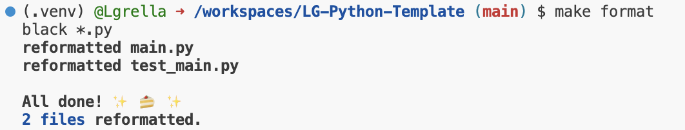
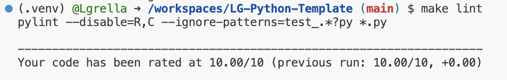
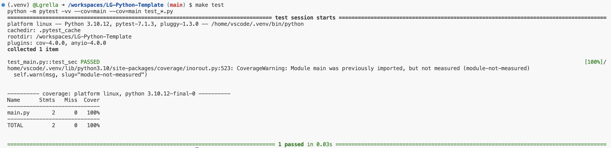

# Python Template
---
This repo is for the mini-project 1 for IDS 706 Data Engineering Systems

---
Using codespaces, this template uses github actions to create a makefile that performs the following:
* `make install`
* `make test`
* `make lint`
* `make format`

This template also includes:
* `main.py` and `test_main.py` to confirm the template and github action are performing as expected.
* dockerfile
* Various package versions in `requirements.txt`

---

This make file will be used in future projects for this class and personal projects. 

---

How to Use:

1. Open Codespaces, allow for the environmenet to be set up
2. Run the make commands: install, format, lint, test

Example Results:

`make format`:

`make lint`:

`make test`:

